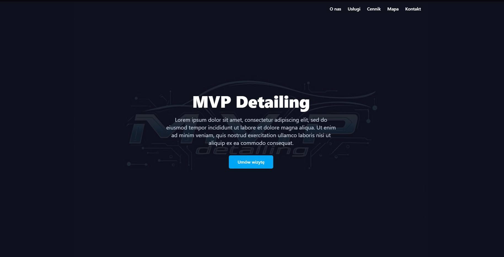
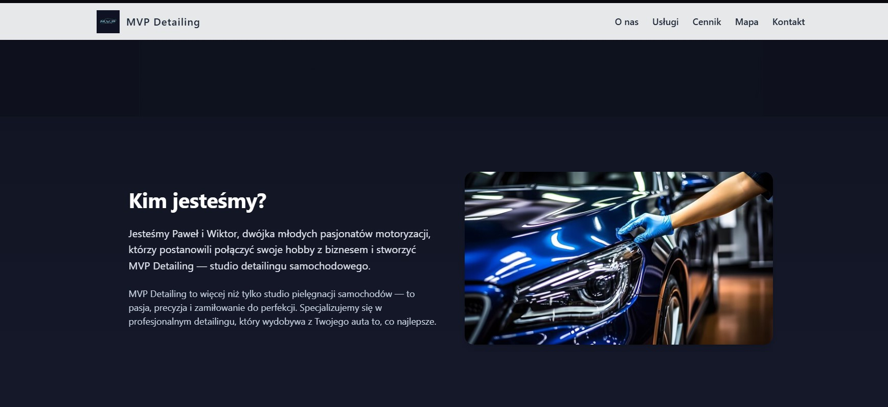
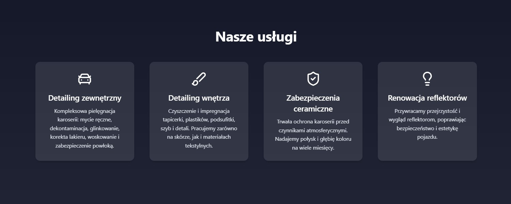
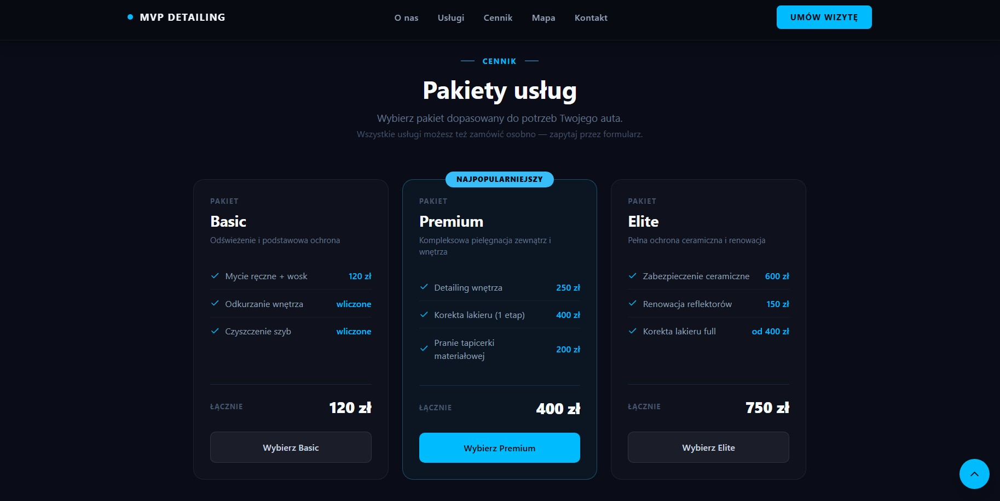
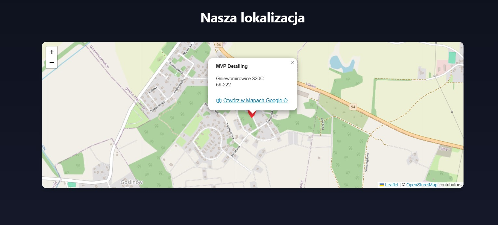
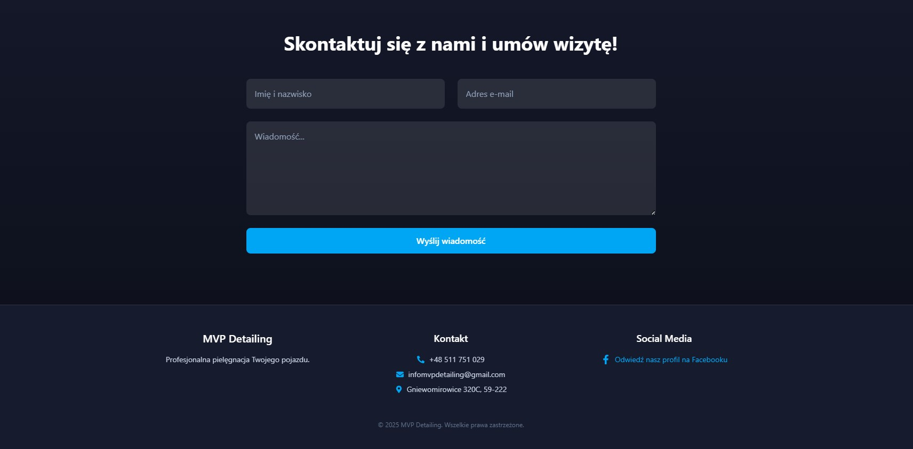
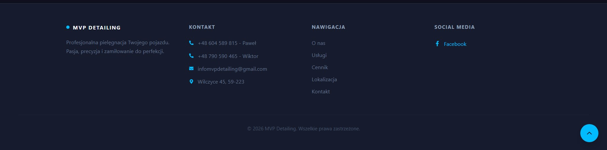

# 🧼 MVP Detailing – Strona internetowa

Responsywna, nowoczesna strona dla studia detailingu - MVP Detailing, prezentująca usługi, cennik i dane kontaktowe.

## 🌐 Stack technologiczny

- **Vite + React + TypeScript** – bundler, framework i język
- **Tailwind CSS** – stylowanie
- **Framer Motion** – animacje i przejścia
- **React Scroll** – płynna nawigacja między sekcjami
- **Zustand** – zarządzanie stanem (wybór pakietu)
- **EmailJS** – obsługa formularza kontaktowego
- **Leaflet** – interaktywna mapa lokalizacji
- **Lucide React + React Icons** – ikonki

## 📄 Funkcje

- Responsywny design na urządzenia mobilne i desktop
- Animacje przy scrollu (Framer Motion)
- Sekcja usług z kartami glassmorphism
- Cennik z pakietami Basic / Premium / Elite / Wycena indywidualna
- Formularz kontaktowy z wyborem pakietu i walidacją
- Interaktywna mapa z kartą informacyjną
- Przycisk powrotu na górę strony

## 🚧 Status

- Wersja po remasterze kodu — odświeżony design, nowe funkcje
- Otwarte na ulepszenia i opinie

## 📂 Struktura projektu

- `/src/components` – Komponenty UI (Hero, Navbar, Services, Pricing, Contact, Footer...)
- `/src/store` – Zustand store (usePricingStore)
- `/src/assets` – Zasoby statyczne (logo, zdjęcia)

## 🖼️ Zrzuty ekranu

### 🏠 Hero
> Sekcja powitalna z animowanym tłem, hasłem i przyciskami CTA.

---

### 👥 O nas
> Prezentacja zespołu MVP Detailing z opisem firmy i zdjęciem.

---

### 🔧 Usługi
> Cztery karty usług w stylu glassmorphism z animacją przy scrollu.

---

### 💰 Cennik
> Pakiety Basic, Premium, Elite i Wycena indywidualna z przejściem do formularza.

---

### 📍 Lokalizacja
> Interaktywna mapa z kartą informacyjną — adres, godziny, telefon i przycisk Google Maps.

---

### ✉️ Formularz kontaktowy
> Formularz z wyborem pakietu, numerem telefonu i walidacją — wysyłka przez EmailJS.

---

### 🦶 Stopka
> Stopka z danymi kontaktowymi, nawigacją i linkiem do social media.

---

## 📜 Licencja

MIT License – szczegóły w pliku [LICENSE](LICENSE).